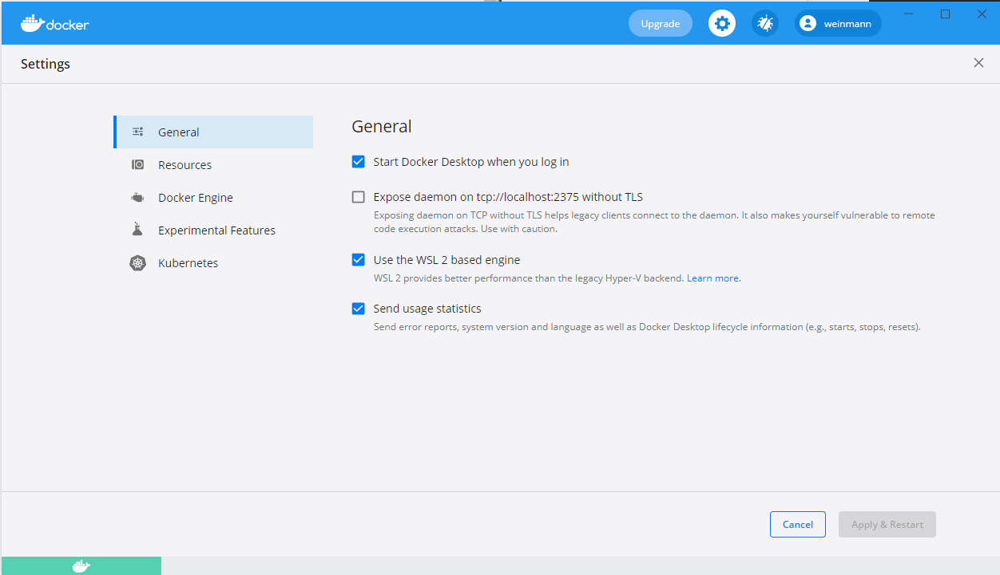

# ora_bench - Benchmark Framework for Oracle Database Drivers.


----

### Table of Contents

**[1. Introduction](#introduction)**<br>
**[2. Framework Tools](#2_framework)**<br>
**[2.1 Benchmark Configuration](#2.1_benchmark)**<br>
**[2.2 Installation](#2.2_installation)**<br>
**[2.3 Benchmark Operation](#2.3_benchmark)**<br>
**[2.4 Benchmark Results](#2.4_benchmark)**<br>
**[2.5 Bulk File](#2.5_bulk)**<br>
**[3. Coding Pattern](#3_coding)**<br>
**[3.1 `Benchmark Function` (main function)](#3.1_benchmark)**<br>
**[3.2 `Trial Function`](#3.2_trial)**<br>
**[3.3 `Insert Control Function`](#3.3_insert)**<br>
**[3.4 `Insert Function`](#3.4_insert)**<br>
**[3.5 `Select Control Function`](#3.5_select)**<br>
**[3.6 `Select Function`](#3.6_select)**<br>
**[4. Driver Specific Features](#4_driver)**<br>
**[4.1 Oracle cx_Oracle and Python](#4.1_oracle)**<br>
**[4.2 Oracle JDBC and Java](#4.2_oracle)**<br>
**[4.3 Oracle JDBC and Kotlin](#4.3_oracle)**<br>
**[4.4 Oracle ODPI-C and C++ (gcc)](#4.4_oracle)**<br>
**[4.5 oranif and Erlang](#4.5_oranif)**<br>

----

## <a name="introduction"></a> 1. Introduction

**`OraBench`** can be used to determine the performance of different Oracle database drivers under identical conditions.
The framework parameters for a benchmark run are stored in a central configuration file.

The currently supported database drivers are:

| Driver           | Programming Language(s) |
| :---             | :---                    |
| godror           | Go                      |
| Oracle cx_Oracle | Python 3                |
| Oracle JDBC      | Java &amp; Kotlin       |
| Oracle ODPI-C    | C++ (gcc)               |
| oranif           | Elixir &amp; Erlang     |

The following Oracle database versions are provided in a benchmark run via Docker container:

| Shortcut   | Oracle Database Version |
| :---       | :--- |
| db_18_4_xe | Oracle Database 18c 18.4 (Express Edition) - Linux x86-64                                        |
| db_19_3_ee | Oracle Database 19c 19.3                   - Linux x86-64                                        |

The results of the benchmark runs are collected in either csv (comma-separated values) or tsv (tab-separated values) files.

## <a name="framework_tools"></a> 2. Framework Tools

### <a name="2.1_benchmark"></a> 2.1 Benchmark Configuration

The benchmark configuration file controls the execution and output of a benchmark run.
The default name for the configuration file is `priv/properties/ora_bench.properties`.
A detailed description of the configuration options can be found [here](docs/benchmark_configuration_parameter.md).
For reasons of convenience the following files are generated:

- the configuration file `priv/ora_bench_c.propperties` for C++ (gcc),
- the configuration file `priv/ora_bench_erlang.properties` with a corresponding map for Erlang, and
- the configuration file `priv/ora_bench_python.propperties` for Python 3.

All the file names specified here are also part of the configuration file and can be changed if necessary.

### <a name="2.2_installation"></a> 2.2 Installation

The easiest way is to download a current release of **`OraBench`** from the GitHub repository.
You can find the necessary link [here](https://github.com/KonnexionsGmbH/ora_bench).

**`OraBench`** is tested under [Ubuntu](https://ubuntu.com) and [Microsoft Windows](https://en.wikipedia.org/wiki/Microsoft_Windows).
In addition, tests are always performed in Windows with Ubuntu under the [Windows Subsystem for Linux (WSL)](https://docs.microsoft.com/en-us/windows/wsl).

To download the repository [Git](https://git-scm.com) is needed and for compilation the following software components are needed:

- [Elixir](https://elixir-lang.org/install.html#windows)
- [Erlang](https://www.erlang.org/downloads/)
- [Go](https://golang.org/dl/)
- [Gradle Build Tool](https://gradle.org/releases/)
- Java, e.g.: the [open-source JDK](https://openjdk.java.net)
- [Kotlin](https://kotlinlang.org/docs/tutorials/command-line.html)
- [Make for Windows](http://gnuwin32.sourceforge.net/packages/make.htm)
- [Oracle Instant Client](https://www.oracle.com/database/technologies/instant-client/winx64-64-downloads.html)
- [Python 3](https://www.python.org/downloads/)
- [rebar3](https://www.rebar3.org/)

For changes to the **`OraBench`** repository it is best to use an editor (e.g. [Vim](https://www.vim.org)) or a swuitable IDE.
For using the Docker Image based databases in operational mode, [Docker Desktop](https://www.docker.com/products/docker-desktop) must also be installed.
For the respective software versions, please consult the document [release notes](Release-Notes.md).

The whole software environment for the operation and further development of OraBench can be created most easily by using a Docker container based on the Konnexions Development Image (version 2.0.4 from [here](https://hub.docker.com/repository/docker/konnexionsgmbh/kxn_dev)).  

Alternatively, in an Ubuntu 20.04 based environment, e.g.: in the Windows Subsystem for Linux or in a virtual machine, the two following scripts can be used to install the necessary software:

- `scripts/kxn_dev/run_install_4-vm_wsl2_1.sh`
- `scripts/kxn_dev/run_install_4-vm_wsl2_2.sh`

  - run `sudo apt update`
  - run `sudo apt install git`
  - run `git clone https://github.com/KonnexionsGmbH/ora_bench` (cloning the **`OraBench`** repository)
  - run `cd ora_bench/scripts/kxn_dev`
  - run `./run_install_4_vm_wsl2_1.sh`
  - close the Ubuntu shell and reopen it again
  - run `cd ora_bench/scripts/kxn_dev`
  - run `./run_install_4_vm_wsl2_2.sh`

If the Windows Subsystem for Linux (WSL) is to be used, then the `WSL INTEGRATION` for Ubuntu must be activated in Docker:




### <a name="2.3_benchmark"></a> 2.3 Benchmark Operation

#### 2.3.1  Script `run_bench_all_dbs_props_std`

This script executes the `run_properties_standard` script for each of the databases listed in chapter Introduction with standard properties. 
At the beginning of the script it is possible to exclude individual databases or drivers from the current benchmark. 
The run log is stored in the `run_bench_all_dbs_props_std.log` file.

##### 2.3.2 Script `run_bench_all_dbs_props_var`

This script executes the `run_properties_variations` script for each of the databases listed in chapter Introduction with variations of properties. 
At the beginning of the script it is possible to exclude individual databases or drivers from the current benchmark. 
The run log is stored in the `run_bench_all_dbs_props_var.log` file.

### <a name="2.4_benchmark"></a> 2.4 Benchmark Results

In a file defined by the configuration parameters `file.result.delimiter`, `file.result.header` and `file.result.name`, the results of the benchmark run with the actions `benchmark`, `trial` and `query` are stored.
In the file directory `priv/statistics` reference statistics files are available per version of **`OraBench`**.
The different file name patterns result from the following operating system environments:

- `..._vmware.tsv`: Ubuntu with VMware Workstation Player on Windows
- `...._win10.tsv`: Windows
- `....._wsl2.tsv`: Ubuntu LTS with Windows Subsystem for Linux on Windows

Excerpts from a sample file can be seen in the following image:


In detail, the following information is available in the result files:

| Column            | Format                          | Content |
| :---              | :---                            | :--- |
| release           | alphanumeric                    | config param `benchmark.release` |
| benchmark id      | alphanumeric                    | config param `benchmark.id` |
| benchmark comment | alphanumeric                    | config param `benchmark.comment` |
| host name         | alphanumeric                    | config param `benchmark.host.name` |
| no. cores         | integer                         | config param `benchmark.number.cores` |
| os                | alphanumeric                    | config param `benchmark.os` |
| user name         | alphanumeric                    | config param `benchmark.user.name` |
| database          | alphanumeric                    | config param `benchmark.database` |
| language          | alphanumeric                    | config param `benchmark.language` |
| driver            | alphanumeric                    | config param `benchmark.driver` |
| trial no.         | integer                         | `0` if action equals `benchmark`, trial no. otherwise |
| SQL statement     | alphanumeric                    | SQL statement if action equals `query`, empty otherwise |
| core multiplier   | integer                         | config param `benchmark.core.multiplier` |
| fetch size        | integer                         | config param `connection.fetch.size` |
| transaction size  | integer                         | config param `benchmark.transaction.size` |
| bulk length       | integer                         | config param `file.bulk.length` |
| bulk size         | integer                         | config param `file.bulk.size` |
| batch size        | integer                         | config param `benchmark.batch.size` |
| action            | alphanumeric                    | one of `benchmark`, `query` or `trial`   |
| start day time    | yyyy-mm-dd hh24:mi:ss.fffffffff | current date and time at the start of the action |
| end day time      | yyyy-mm-dd hh24:mi:ss.fffffffff | current date and time at the end of the action |
| duration (sec)    | integer                         | time difference in seconds between start time and end time of the action |
| duration (ns)     | integer                         | time difference in nanoseconds between start time and end time of the action |

### <a name="2.5_bulk"></a> 2.5 Bulk File

The bulk file in `csv` or `tsv` format is created in the `run_create_bulk_file` script if it does not already exist. 
The following configuration parameters are taken into account:

- `file.bulk.delimiter`
- `file.bulk.header`
- `file.bulk.length`
- `file.bulk.name`
- `file.bulk.size`

The data column in the bulk file is randomly generated with a unique key column (MD5 hash code).

## <a name="coding_pattern"></a> 3. Coding Patterns

### <a name="3.1_benchmark"></a> 3.1 `Benchmark Function` (main function)

```
    run_benchmark()
    
        save the current time as the start of the 'benchmark' action
    
        READ the configuration parameters into the memory (config params `file.configuration.name ...`)
        READ the bulk file data into the partitioned collection bulk_data_partitions (config param 'file.bulk.name')
            partition key = modulo (ASCII value of 1st byte of key * 256 + ASCII value of 2nd byte of key, 
                                    number partitions (config param 'benchmark.number.partitions'))
        Create a separate database connection (without auto commit behaviour) for each partition                            
        
        trial_no = 0
        WHILE trial_no < config_param 'benchmark.trials'
            DO run_benchmark_trial(database connections, trial_no, bulk_data_partitions)
        ENDWHILE    
        
        partition_no = 0
        WHILE partition_no < config_param 'benchmark.number.partitions'
            close the database connection
        ENDWHILE    
        
        WRITE an entry for the action 'benchmark' in the result file (config param 'file.result.name')
```

### <a name="3.2_trial"></a> 3.2 `Trial Function`

```
    run_trial(database connections, trial_no, bulk_data_partitions)
    INPUT: the database connections
           the current trial number
           the partitioned bulk data
    
        save the current time as the start of the 'trial' action
    
        create the database table (config param 'sql.create')
        
        IF error
            drop the database table (config param 'sql.drop')
            create the database table (config param 'sql.create')
        ENDIF    
        
        DO run_benchmark_insert(database connections, trial_no, bulk_data_partitions)
        DO run_benchmark_select(database connections, trial_no, bulk_data_partitions)
        
        drop the database table (config param 'sql.drop')
        
        WRITE an entry for the action 'trial' in the result file (config param 'file.result.name')
```

### <a name="3.3_insert"></a> 3.3 `Insert Control Function`

```
    run_insert(database connections, trial_no, bulk_data_partitions)
    INPUT: the database connections
           the current trial number
           the partitioned bulk data
    
        save the current time as the start of the 'query' action
     
        partition_no = 0
        WHILE partition_no < config_param 'benchmark.number.partitions'
            IF config_param 'benchmark.core.multiplier' = 0
                DO Insert(database connections(partition_no), bulk_data_partitions(partition_no)) 
            ELSE    
                DO Insert(database connections(partition_no), bulk_data_partitions(partition_no)) as a thread
        ENDWHILE    

        WRITE an entry for the action 'query' in the result file (config param 'file.result.name')
```

### <a name="3.4_insert"></a> 3.4 `Insert Function`

```
    insert(database connection, bulk_data_partition)
    INPUT: the database connection
           the bulk data partition
    
        count = 0
        collection batch_collection = empty
        
        WHILE iterating through the collection bulk_data_partition
            count + 1
            
            add the SQL statement in config param 'sql.insert' with the current bulk_data entry to the collection batch_collection 
            IF config_param 'benchmark.batch.size' > 0
                IF count modulo config param 'benchmark.batch.size' = 0 
                    execute the SQL statements in the collection batch_collection
                    batch_collection = empty
                ENDIF                    
            END IF
            
            IF config param 'benchmark.transaction.size' > 0 AND count modulo config param 'benchmark.transaction.size' = 0
                commit
            ENDIF    
        ENDWHILE

        IF collection batch_collection is not empty
            execute the SQL statements in the collection batch_collection
        ENDIF

        commit
```

### <a name="3.5_select"></a> 3.5 `Select Control Function`

```
    run_select(database connections, trial_no, bulk_data_partitions)
    INPUT: the database connections
           the current trial number
           the partitioned bulk data
    
        save the current time as the start of the 'query' action
     
        partition_no = 0
        WHILE partition_no < config_param 'benchmark.number.partitions'
            IF config_param 'benchmark.core.multiplier' = 0
                DO Select(database connections(partition_no), bulk_data_partitions(partition_no, partition_no) 
            ELSE    
                DO Select(database connections(partition_no), bulk_data_partitions(partition_no, partition_no) as a thread
        ENDWHILE    

        WRITE an entry for the action 'query' in the result file (config param 'file.result.name')
```

### <a name="3.6_select"></a> 3.6 `Select Function`

```
    run_select(database connection, bulk_data_partition, partition_no)
    INPUT: the database connection
           the bulk data partition
           the current partition number
    
        save the current time as the start of the 'query' action
     
        count = 0

        execute the SQL statement in config param 'sql.select' 

        WHILE iterating through the result set
            count + 1
        ENDWHILE

        IF NOT count = size(bulk_data_partition)
            display an error message            
        ENDIF                    
```

## <a name="driver_specifica"></a> 4. Driver Specific Features

### <a name="4.1_oracle"></a> 4.1 Oracle cx_Oracle and Python 3

- all configuration parameters are managed by the program OraBench.java and made available in a suitable file (`file.configuration.name.python`) 
- Python 3 uses for batch operations the `executemany` method of the `cursor` class for the operation `INSERT`
- the value fetch size (`connection.fetch.size`) is not used because the operation `SELECT` uses the operation `Cursor.fetchall()`

### <a name="4.2_oracle"></a> 4.2 Oracle JDBC and Java

- the Java source code is compiled with the help of Gradle
- Java uses the `PreparedStatement` class for the operations `INSERT` and `SELECT`
- Java uses for batch operations the `executeBatch` method of the `PreparedStatement` class for the operation `INSERT`

### <a name="4.3_oracle"></a> 4.3 Oracle JDBC and Kotlin

- the Kotlin source code is compiled with the help of Gradle
- Kotlin uses the `PreparedStatement` class for the operations `INSERT` and `SELECT`
- Kotlin uses for batch operations the `executeBatch` method of the `PreparedStatement` class for the operation `INSERT`

### <a name="4.4_oracle"></a> 4.4 Oracle ODPI-C and C++ (gcc)

- all configuration parameters are managed by the program OraBench.java and made available in a suitable file (`file.configuration.name.c`) 

### <a name="4.5_oranif"></a> 4.5 oranif and Erlang

- all configuration parameters are managed by the program OraBench.java and made available in a suitable file (`file.configuration.name.erlang`) 
