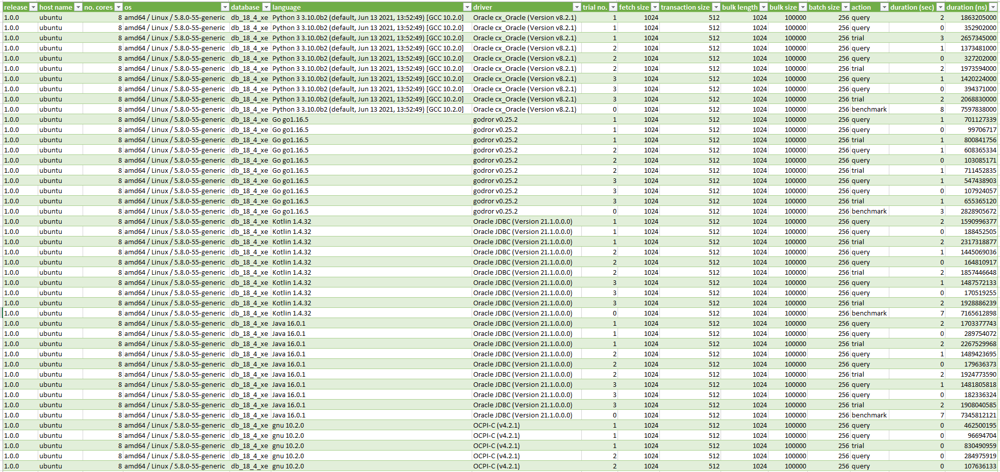

# OraBench - Benchmark Framework for Oracle Database Drivers.

----

### Table of Contents

**[1. Introduction](#introduction)** 
**[2. Framework Tools](#2_framework)** 
**[2.1 Benchmark Configuration](#2.1_benchmark)** 
**[2.2 Installation](#2.2_installation)** 
**[2.3 Benchmark Operation](#2.3_benchmark)** 
**[2.4 Benchmark Results](#2.4_benchmark)** 
**[2.5 Bulk File](#2.5_bulk)** 

----

##  1. Introduction

**`OraBench`** can be used to determine the performance of different Oracle database drivers under identical conditions. The framework parameters for a
benchmark run are stored in a central configuration file.

The currently supported database drivers are:

| Driver | Programming Language(s) |
| :---   | :---                    |
| [cx_Oracle](https://oracle.github.io/python-cx_Oracle) | [Python 3](https://www.python.org) |
| [godror](https://golangrepo.com/repo/godror-godror-go-database-drivers) | [Go](https://golang.org)|
| [JDBC.jl](https://github.com/felipenoris/JDBC.jl) | [Julia](https://julialang.org) |
| [Oracle JDBC](https://www.oracle.com/database/technologies/appdev/jdbc.html) | [Java](https://openjdk.java.net) &amp; [Kotlin](https://kotlinlang.org) |
| [Oracle ODPI-C](https://oracle.github.io/odpi) | [C++](https://docs.microsoft.com/en-us/cpp/?view=msvc-160) ([gcc](https://gcc.gnu.org)) |
| [Oracle.jl](https://github.com/felipenoris/Oracle.jl) | [Julia](https://julialang.org) |
| [oranif](https://github.com/KonnexionsGmbH/oranif) | [Elixir](https://elixir-lang.org) &amp; [Erlang](https://www.erlang.org) |
| [Rust-oracle](https://github.com/kubo/rust-oracle) | [Rust](https://www.rust-lang.org) |

The following Oracle database versions are provided in a benchmark run via Docker container:

| Shortcut   | Oracle Database Version |
| :---       | :--- |
| db_18_4_xe | [Oracle Database 18c 18.4 (Express Edition) - Linux x86-64](https://docs.oracle.com/en/database/oracle/oracle-database/18/) |
| db_19_3_ee | [Oracle Database 19c 19.3 - Linux x86-64](https://docs.oracle.com/en/database/oracle/oracle-database/19/index.html) |
| db_21_3_ee | [Oracle Database 21c 21.3 - Linux x86-64](https://docs.oracle.com/en/database/oracle/oracle-database/21/index.html) |

The results of the benchmark runs are collected in either csv (comma-separated values) or tsv (tab-separated values) files.

----

##  2. Framework Tools

###  2.1 Benchmark Configuration

The benchmark configuration file controls the execution and output of a benchmark run. The default name for the configuration file
is `priv/properties/ora_bench.properties`. A detailed description of the configuration options can be found [here](docs/benchmark_configuration_parameter.md).
For reasons of convenience the following files are generated:

- the configuration file `priv/ora_bench_c.propperties` for C++ (gcc),
- the configuration file `priv/ora_bench_erlang.properties` with a corresponding map for Erlang, and
- the configuration file `priv/ora_bench_python.propperties` for Python 3.
- the configuration file `priv/ora_bench_toml.propperties` for Julia.

All the file names specified here are also part of the configuration file and can be changed if necessary.

###  2.2 Installation

The easiest way is to download a current release of **`OraBench`** from the GitHub repository. You can find the necessary
link [here](https://github.com/KonnexionsGmbH/ora_bench).

**`OraBench`** is tested under [Ubuntu](https://ubuntu.com).

[Git](https://git-scm.com) is needed to download the repository and for compilation the following software components are needed:

- [Elixir](https://elixir-lang.org/install.html#windows)
- [Erlang](https://www.erlang.org/downloads/)
- [gcc Windows](https://jmeubank.github.io/tdm-gcc/) or [gcc Ubuntu](https://gcc.gnu.org/)
- [Go](https://golang.org/dl/)
- [Gradle Build Tool](https://gradle.org/releases/)
- [Java, e.g. the open-source JDK](https://openjdk.java.net)
- [Julia](https://julialang.org/downloads/)
- [Kotlin](https://kotlinlang.org/docs/tutorials/command-line.html)
- [Oracle Instant Client](https://www.oracle.com/database/technologies/instant-client/winx64-64-downloads.html)
- [Python 3](https://www.python.org/downloads/)
- [rebar3](https://www.rebar3.org/)
- [Rust](https://www.rust-lang.org)

For changes to the **`OraBench`** repository it is best to use an editor (e.g. [Vim](https://www.vim.org)) or a suitable IDE. For using the Docker Image based
databases in operational mode, [Docker Desktop](https://www.docker.com/products/docker-desktop) must also be installed. For the respective software versions,
please consult the document [release notes](Release-Notes.md).

The whole software environment for the operation and further development of OraBench can be created most easily by using a Docker container (version 1.2.0 from [here](https://hub.docker.com/repository/docker/konnexionsgmbh/ora_bench_dev)).

Alternatively, in an Ubuntu 20.04 based environment, e.g.: in a virtual machine, the two following scripts can be used to install the necessary software:

- `scripts/1.2.0/run_install_4-vm_wsl2_1.sh`
- `scripts/1.2.0/run_install_4-vm_wsl2_2.sh`

    - run `sudo apt update`
    - run `sudo apt install git`
    - run `git clone https://github.com/KonnexionsGmbH/ora_bench` (cloning the **`OraBench`** repository)
    - run `cd ora_bench/scripts/kxn_dev`
    - run `./run_install_4_vm_wsl2_1.sh`
    - close the Ubuntu shell and reopen it again
    - run `cd ora_bench/scripts/kxn_dev`
    - run `./run_install_4_vm_wsl2_2.sh`

###  2.3 Benchmark Operation

#### 2.3.1  Script `run_ora_bench`

This script executes the `run_properties_standard` script for each of the databases listed in chapter Introduction with standard properties. At the beginning of
the script it is possible to exclude individual databases or drivers from the current benchmark. The run log is stored in the `run_ora_bench.log`
file.

###  2.4 Benchmark Results

In a file defined by the configuration parameters `file.result.delimiter`, `file.result.header` and `file.result.name`, the results of the benchmark run with
the actions `benchmark`, `trial` and `query` are stored. In the file directory `priv/statistics` reference statistics files are available per version
of **`OraBench`**.

Excerpts from a sample file can be seen in the following image:

In detail, the following information is available in the result files:

| Column            | Format                          | Content |
| :---              | :---                            | :--- |
| release           | alphanumeric                    | config param `benchmark.release` |
| benchmark id      | alphanumeric                    | config param `benchmark.id` |
| benchmark comment | alphanumeric                    | config param `benchmark.comment` |
| host name         | alphanumeric                    | config param `benchmark.host.name` |
| no. cores         | integer                         | config param `benchmark.number.cores` |
| os                | alphanumeric                    | config param `benchmark.os` |
| user name         | alphanumeric                    | config param `benchmark.user.name` |
| database          | alphanumeric                    | config param `benchmark.database` |
| language          | alphanumeric                    | config param `benchmark.language` |
| driver            | alphanumeric                    | config param `benchmark.driver` |
| trial no.         | integer                         | `0` if action equals `benchmark`, trial no. otherwise |
| SQL statement     | alphanumeric                    | SQL statement if action equals `query`, empty otherwise |
| core multiplier   | integer                         | config param `benchmark.core.multiplier` |
| fetch size        | integer                         | config param `connection.fetch.size` |
| transaction size  | integer                         | config param `benchmark.transaction.size` |
| bulk length       | integer                         | config param `file.bulk.length` |
| bulk size         | integer                         | config param `file.bulk.size` |
| batch size        | integer                         | config param `benchmark.batch.size` |
| action            | alphanumeric                    | one of `benchmark`, `query` or `trial`   |
| start day time    | yyyy-mm-dd hh24:mi:ss.fffffffff | current date and time at the start of the action |
| end day time      | yyyy-mm-dd hh24:mi:ss.fffffffff | current date and time at the end of the action |
| duration (sec)    | integer                         | time difference in seconds between start time and end time of the action |
| duration (ns)     | integer                         | time difference in nanoseconds between start time and end time of the action |

###  2.5 Bulk File

The bulk file in `csv` or `tsv` format is created in the `run_create_bulk_file` script if it does not already exist. The following configuration parameters are
taken into account:

- `file.bulk.delimiter`
- `file.bulk.header`
- `file.bulk.length`
- `file.bulk.name`
- `file.bulk.size`

The data column in the bulk file is randomly generated with a unique key column (MD5 hash code).
